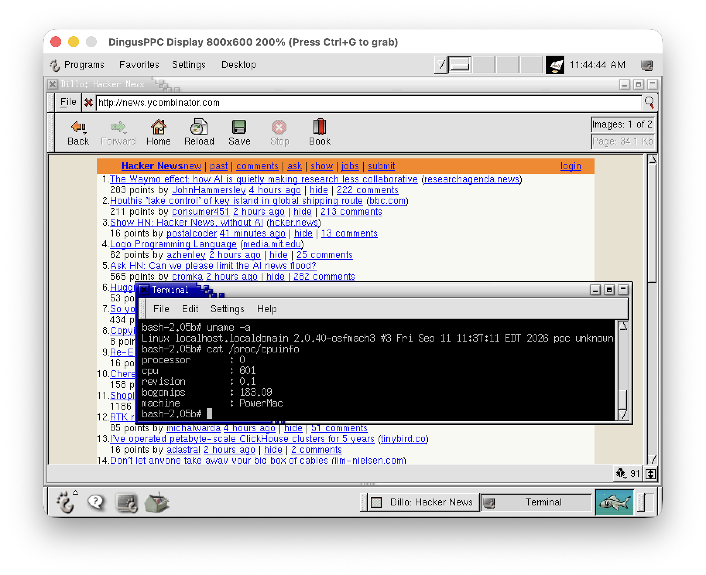

# ChungusPPC



A [DingusPPC](https://github.com/dingusdev/dingusppc) fork for running
and rebuilding MkLinux on emulated Power Macs.

Big thanks to the DingusPPC crew. We use AI tools, so we're keeping this work
in a separate fork out of respect for their contribution policy.

[Contributing](CONTRIBUTING.md) · [Credits](CREDITS.md)

## MkLinux status

We've rebuilt Mach and ported the MkLinux server to Linux 2.0.40. The same
binaries boot on these 16 emulated Macs, using Mac OS 7.6.1 and the R2 booter:

| Family | Tested models |
| --- | --- |
| NuBus Power Macs | 6100, 7100, 8100 |
| Early PCI Power Macs | 7200, 7300, 7500, 7600, 8500, 8600 |
| PCI with Mach64 GX | 9500, 9600 |
| Alchemy | 5400, 6400 |
| Gazelle | 5500, 6500, Twentieth Anniversary Macintosh |

We've checked color consoles, disk and CD checksums, and files surviving a
reboot. MACE Ethernet passed DHCP, DNS, telnet and file transfers in both
directions. Both motherboard ROM revisions work on the 8600/9600; the 9500
also works with either of the two Mach64 GX card ROMs we tried.
The 5400, 6400, 5500, 6500 and TAM also boot Mac OS and MkLinux from a single
IDE disk.

X/GNOME also works on the 6100, 6400, 6500, 7500 and 9500. X hasn't been
checked across the full list.
Audio and floppy reads/writes work on the 6100, 5400, 6400, 6500 and 7500.
Both serial ports passed binary transfers on the 7500 and 8100; serial login
also works.
Alchemy/Gazelle have no emulated Ethernet. ATI Rage text and window drawing
work on the 6500/5500/TAM; some
accelerator operations are still missing. Some models share the same emulated
hardware, and some need a particular display mode. See the
[model notes](zdocs/users/mklinux.md).

The [build notes](mklinux-selfhost/README.md) have the patches, source checksums
and commands for rebuilding Mach and Linux in MkLinux.
[Current status and next checks](mklinux-selfhost/STATUS.md).

## Performa 6200

We've added the Power Macintosh 5200 and Performa 6200. MkLinux boots on both:
`pm5200` and `pm6200` reach a login in color with keyboard and mouse on the
Performa Mach kernel, and a full R2 install runs from CD onto a blank disk
(Release 2.0, Linux 2.0.38, Red Hat 6.2). Their SCSI has no DMA engine, so
transfers run at about 150 KB/s. The
[bring-up notes](zdocs/developers/cordyceps-handoff.md) have the details.

## Build

Requires a C++20 compiler, CMake and SDL2. Install libslirp and pkg-config for
user-mode networking; CMake enables it when found.

```sh
git clone https://github.com/timdoug/chungusppc
cd chungusppc
git submodule update --init --recursive
cmake -S . -B build -DCMAKE_BUILD_TYPE=Release
cmake --build build -j
```

The executable lands in:

- Linux: `build/bin/chungusppc`
- macOS: `build/bin/chungusppc.app/Contents/MacOS/chungusppc`
- Windows: `build/bin/chungusppc.exe` (some generators add a `Release/` directory)

## Run

You'll need a machine ROM and disk images with Mac OS and MkLinux installed
([setup guide](zdocs/users/mklinux.md)). For a 7200:

```sh
chungusppc -r -m pm7200 -b bootrom.bin --rambank1_size 128 \
    --hdd_img "macos.img:mklinux.img" --enet_backend=slirp
```

Use the executable path above if it isn't on your `PATH`.
`chungusppc list machines` lists machines; `--help` lists options.
`-d` starts the debugger; Ctrl-C enters it while the emulator is running. See the
[user manual](zdocs/users/manual.md) for device settings and automation tools.

## Tests

```sh
cmake -S . -B build -DDPPC_BUILD_DEVICE_TESTS=ON
cmake --build build -j
ctest --test-dir build --output-on-failure
```

For the CPU tests, enable `-DDPPC_BUILD_PPC_TESTS=ON` and build `testppc`.
Run it from `build/bin` so it can find its CSV files.
